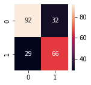

<br/>
<p align="center">
  <h1 align="center">Breast Cancer Survival Prediction</h3>

  <p align="center">
    Predicting breast cancer survival using machine learning models with clinical data and gene expression profiles.
    <br/>
    <br/>
  </p>
</p>

## About The Project

This is the project for the "Introduction to Machine Learning" course at Sharif University of Technology. In this project, we are going to predict the survival of patients with breast cancer using machine learning models with clinical data and gene expression profiles. The dataset used in this project is the [Breast Cancer Gene Expression Profiles (METABRIC)](https://www.kaggle.com/datasets/raghadalharbi/breast-cancer-gene-expression-profiles-metabric).


First, we did some preprocessing and EDA on the clinical data and gene expression profiles. 
Then, we investigated whether it is needed to use a dimensionality reduction approach or not.
Afterwards, we used different machine learning models (Classical and Neural Network methods) to predict the survival of patients. 
Finally, we compared the results of different models and different datasets.

## Results
First, we analyzed effect of age on survival.
From the charts below we can have the following interpretation that if the disease is diagnosed at early ages there is a better chance that the patient survive, but, we have to consider the fact that the death from the disease somehow overlaps with the living box and that chance isn't that much. At least we can say that diagnosis after age 85 is not effective.


Then, we analyzed effect of tumor stage on survival. From the chart below, we can tell that if the patient is in stage 1 the probability of surviving is much higher if she was in stage 2, 3 or 4. Although in stage 2 the chance of surviving is pretty high.


The next step was to analyze the effect of tumor size on survival. We can say that the every tumor sizes kills! But when it's bigger, it will kill more. Also, tumors with bigger sizes are probable to be in stages 3 that considering the results in the section above, they will be more dangerous. 


Different therapy methods have different effects on survival. There are three therapy methods mentioned in the data set
  1. `chemotherapy`                   
  2. `radio_therapy`
  3. `hormone_therapy`

From the charts below we can find out:
  * Every patient tried at least one type of therapy
  * radio therapy and hormone therapies were more effective and 
      was used together more frequently.


Finally, we analyzed the correlation between different features and survival.


### Dimensionality Reduction
We used [PCA](https://en.wikipedia.org/wiki/Principal_component_analysis) and [UMAP](https://en.wikipedia.org/wiki/Nonlinear_dimensionality_reduction#Uniform_manifold_approximation_and_projection) to reduce the dimensionality of the gene expression profiles.

### Classical Models
We implemented classic classification models for clinical, gene expressions, and reduced gene expressions datasets.
We used scikit-learn library to build and train the models. 
We didn't stopped at Random Forest model and examined different methods for the datasets and compared them together. 
This work is done for each dataset (i.e. clinical, gene expression and reduced gene expression). 
The models that are used are as follow:
* Random Forest
* Logistic Regression
* AdaBoost
* XGBoost
* Support Vector Classifier

The classification result on clinical data is as follow:
```
========== Train =========================
      Random Forest :  1.00
      Logistic Regression :  0.79
      Ada Boost :  0.87
      XGBoost :  0.90
      SVC :  0.87
========== Test ==========================
      Random Forest :  0.76
      Logistic Regression :  0.71
      Ada Boost :  0.75
      XGBoost :  0.75
      SVC :  0.76
```

And here are the RoC Curves:


The classification result on gene expression data is as follow:
```
========== Train =========================
      Random Forest :  0.95
      Logistic Regression :  1.00
      Ada Boost :  0.98
      XGBoost :  1.00
      SVC :  0.93
========== Test ==========================
      Random Forest :  0.64
      Logistic Regression :  0.63
      Ada Boost :  0.58
      XGBoost :  0.66
      SVC :  0.70
```

And here are the RoC Curves:


Finally, the classification result on reduced gene expression data is as follow:
```
========== Train =========================
      Random Forest :  0.80
      Logistic Regression :  0.60
      Ada Boost :  0.80
      XGBoost :  0.85
      SVC :  0.60
========== Test ==========================
      Random Forest :  0.65
      Logistic Regression :  0.64
      Ada Boost :  0.60
      XGBoost :  0.62
      SVC :  0.66
```

And here are the RoC Curves:


### Neural Network Models

We implemented a neural network model for clinical, gene expressions, and reduced gene expressions datasets.

The confusion matrix for different datasets are as follow:

<!-- 

 -->

<table>
  <tr align="center">
    <td>Clinical</td>
    <td>Gene Expression</td>
    <td>Reduced Gene Expression</td>
  </tr>
  <tr align="center">
    <td></td>
    <td></td>
    <td></td>
  </tr>
 </table>

### Conclusion

According to the results, classical models work better on the given datasets.
Because the data is sparse and building a complex model over it results in overfitting.
So, simpler models such as Random Forrest and XGBoost reach better results on Clinical and Reduced Gene Expression datasets and on par on Gene Expression dataset.


## Contributors

* [Ali Hatami](https://github.com/alihatamitajik)
* [Mohammadreza Mofayezi](https://github.com/ckoorosh)
